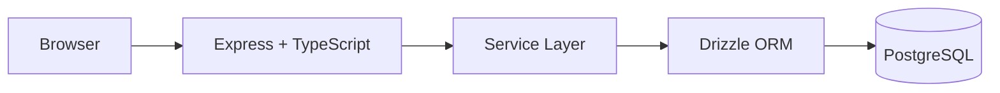
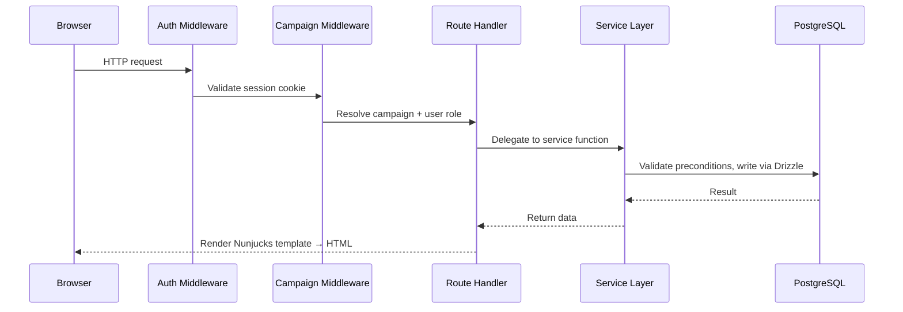
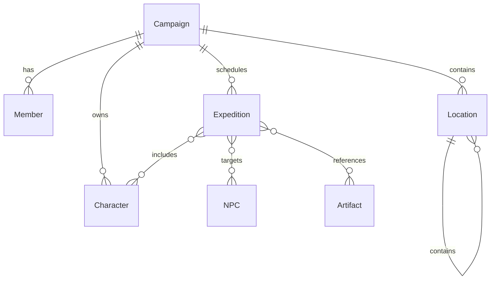

# Marches — System Design Overview

Campaign management tool for West Marches-style tabletop RPG campaigns, where 10–20+ players share one living world, play in self-organised groups, and every session permanently changes what everyone else finds when they show up next. The core challenge: maintain consistent shared world state across multiple concurrent users with different permission levels, while preventing GMs from unknowingly scheduling conflicts against each other.

---

## Architecture

All world state lives in PostgreSQL. The server owns every transition. No client-side state, no separate API layer.

---

## Key Design Decisions

### 1. Role-based access control via middleware

Every request goes through middleware that resolves the current user's campaign membership and role (admin / GM / player / observer). Route handlers and templates use this to gate actions. Role checks are centralised — not duplicated across routes.

### 2. Conflict detection before expedition commit

Before a GM creates an expedition, the service queries all scheduled and active expeditions in the same campaign and checks for overlapping targets (same location, NPC, or artifact). Conflicts surface as warnings rather than hard blocks — GMs see the information they need to coordinate without being prevented from proceeding.

### 3. Visibility system for GM-controlled reveals

Locations, NPCs, and artifacts have a `revealed` flag. Unrevealed entities are hidden from players in queries and the activity feed. GMs can prepare content without it leaking until they're ready to surface it.

### 4. Self-referential location hierarchy

Locations nest arbitrarily deep using a `parent_id → locations.id` self-referential foreign key. A dungeon is a child of a forest; a throne room is a child of the dungeon. No separate hierarchy table needed.

### 5. Server-rendered HTML with HTMX

No React or frontend framework. Pages are rendered on the server as complete HTML. HTMX handles small interactive updates — loading journal entries inline, swapping status badges — by replacing DOM fragments. This eliminates a client-server API layer entirely.

---

## Request Flow

Role resolution happens once per request. Templates receive only what the server decides is visible to the current user.

---

## Data Model

22 tables, 8 enums. The schema is campaign-scoped — almost every entity belongs to a campaign and every query is filtered by campaign ID. All mutations go through the service layer; no direct database access from route handlers.

---

## Testing & Deployment

**Unit tests** cover pure functions with no database dependency: slug generation, in-world date arithmetic, input validation rules.

**Integration tests** run against a real PostgreSQL container managed by Docker — no mocks. This catches constraint violations and NULL handling that in-memory stubs miss. The test database runs migrations automatically before the suite starts; no manual setup required.

**Deployment**: Docker multi-stage build → Fly.io. TypeScript compiles in the builder stage, Tailwind purges unused classes, migrations run on container start. Sessions use secure cookies behind Fly.io's proxy; CSRF tokens validate all state-changing requests; auth endpoints are rate-limited.

---

## Key Technical Takeaways

- Relational modelling at scale: 22 tables, self-referential hierarchy, polymorphic journal associations
- Multi-tenancy via campaign-scoped query isolation
- Role-based access control centralised at the middleware layer — not scattered across routes
- Pre-commit conflict detection through query-time overlap checking
- Server-rendered progressive enhancement — no frontend framework, no client-side state to synchronise
- Integration tests against a real database with zero mocks
